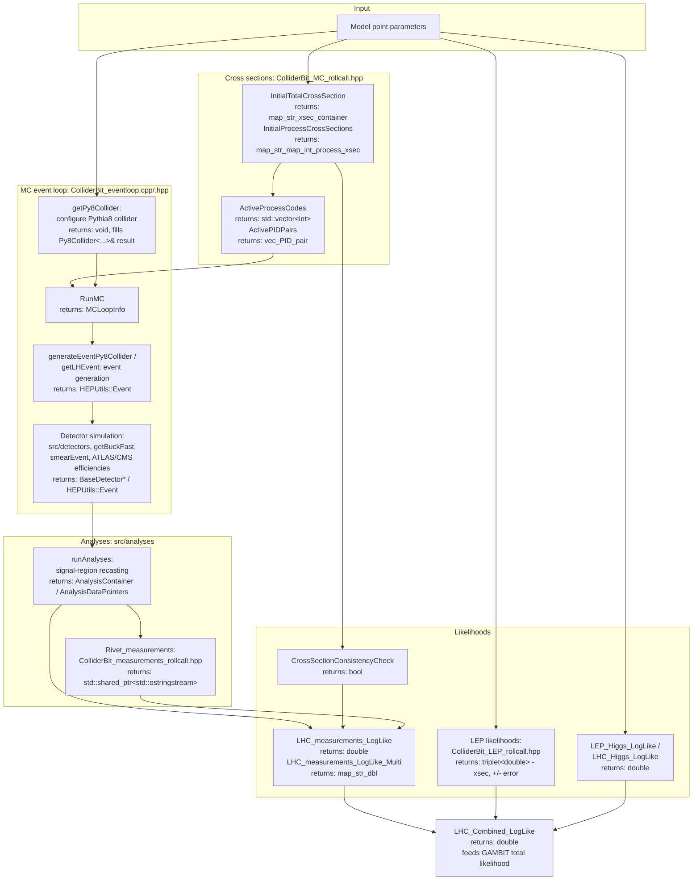

# ColliderBit

ColliderBit is the GAMBIT module responsible for computing collider
(mainly LHC and LEP) likelihoods for a given model point. It drives Monte
Carlo event generation, detector simulation, signal-region/analysis
recasting, and combines the results into log-likelihoods that feed back
into the GAMBIT scan.

Like other GAMBIT modules, ColliderBit exposes its functionality through
`CAPABILITY`/`FUNCTION` declarations (see `include/gambit/ColliderBit/*_rollcall.hpp`);
the diagram below shows how those capabilities are chained together at
runtime, with each node annotated with the C++ return type declared in its
`START_FUNCTION(...)` macro, rather than the literal call graph.

## Pipeline overview

## Key source locations

| Stage | Key capability | Return type | Files |
|---|---|---|---|
| Cross sections | `InitialTotalCrossSection` | `map_str_xsec_container` | `include/gambit/ColliderBit/ColliderBit_MC_rollcall.hpp`, `src/xsec.cpp`, `src/getxsec.cpp` |
| Cross sections | `ActiveProcessCodes` | `std::vector<int>` | same as above |
| Collider/event-loop setup | `RunMC` | `MCLoopInfo` | `include/gambit/ColliderBit/ColliderBit_eventloop.hpp`, `src/ColliderBit_eventloop.cpp`, `include/gambit/ColliderBit/getPy8Collider.hpp` |
| Event generation | `HardScatteringEvent` | `HEPUtils::Event` / `HepMC3::GenEvent` | `include/gambit/ColliderBit/generateEventPy8Collider.hpp`, `src/getHepMCEvent.cpp`, `src/getLHEvent.cpp`, `src/lhef2heputils.cpp` |
| Detector simulation | `ATLASDetectorSim` / `ATLASSmearedEvent` | `BaseDetector*` / `HEPUtils::Event` | `src/detectors/`, `src/getBuckFast.cpp`, `src/smearEvent.cpp`, `include/gambit/ColliderBit/ATLASEfficiencies.hpp`, `CMSEfficiencies.hpp` |
| Analyses / recasting | `ATLASAnalysisContainer` / `AllAnalysisNumbers` | `AnalysisContainer` / `AnalysisDataPointers` | `src/analyses/`, `src/runAnalyses.cpp`, `src/getAnalysisContainer.cpp` |
| Measurements (Rivet/Contur) | `Rivet_measurements` / `LHC_measurements` | `std::shared_ptr<std::ostringstream>` / `Contur_output` | `include/gambit/ColliderBit/ColliderBit_measurements_rollcall.hpp`, `src/ColliderBit_measurements.cpp` |
| LEP likelihoods | `LEP207_xsec_chi00_11` (representative) | `triplet<double>` | `include/gambit/ColliderBit/ColliderBit_LEP_rollcall.hpp`, `src/ColliderBit_LEP.cpp`, `src/lep_mssm_xsecs.cpp` |
| Higgs likelihoods | `LEP_Higgs_LogLike` / `LHC_Higgs_LogLike` | `double` | `include/gambit/ColliderBit/ColliderBit_Higgs_rollcall.hpp`, `src/ColliderBit_Higgs.cpp` |
| Combined LHC likelihood | `LHC_Combined_LogLike` | `double` | `include/gambit/ColliderBit/ColliderBit_MC_rollcall.hpp` |
| MC convergence/loop control | `MCLoopInfo` | `MCLoopInfo` | `include/gambit/ColliderBit/MCLoopInfo.hpp`, `MC_convergence.hpp`, `src/MCLoopInfo.cpp`, `src/MC_convergence.cpp` |

This is a high-level pipeline view, not an exhaustive capability/function
reference — see the `*_rollcall.hpp` headers for the full set of
`CAPABILITY`/`FUNCTION` declarations and their dependency requirements.
