# CosmoBit

CosmoBit is the GAMBIT module responsible for computing cosmological
observables and likelihoods for a given model point. It sets up and drives
external cosmology backends (CLASS via the `classy` Python interface,
MultiModeCode, AlterBBN, MontePython, and the Planck likelihood code), and
combines their outputs into log-likelihoods for the early-Universe (BBN,
CMB, N_eff), late-Universe (background expansion, structure growth) and
dark-matter-related cosmological observables that feed back into the GAMBIT
scan.

Like other GAMBIT modules, CosmoBit exposes its functionality through
`CAPABILITY`/`FUNCTION` declarations (see
`include/gambit/CosmoBit/CosmoBit_rollcall.hpp`); the diagram below shows how
those capabilities are chained together at runtime, with each node
annotated with the C++ return type declared in its `START_FUNCTION(...)`
macro, rather than the literal call graph.

## Pipeline overview

```mermaid
flowchart TD
    subgraph Input["Model point parameters"]
        Model["Cosmological &amp; particle physics<br/>model parameters"]
    end

    subgraph DMcosmo["Dark matter cosmology: CosmoBit_rollcall.hpp / CosmoALPs.cpp"]
        Lifetime["lifetime<br/>returns: double"]
        MinAbund["minimum_abundance<br/>returns: double"]
        MinFrac["minimum_fraction<br/>returns: double"]
        DMFrac["DM_fraction<br/>returns: double"]
        TotAbund["total_DM_abundance<br/>returns: double"]
        ExtNeff["external_dNeff_etaBBN<br/>returns: map_str_dbl"]
        EnergyInjEff["energy_injection_efficiency<br/>returns: DarkAges::Energy_injection_efficiency_table"]
        EnergyInjSpec["energy_injection_spectrum<br/>returns: DarkAges::Energy_injection_spectrum"]
        Feff["f_eff<br/>returns: double"]
        Pann["p_ann<br/>returns: double"]
        LnLPann["lnL_p_ann<br/>returns: double"]
    end

    subgraph Background["Background cosmology: CosmoBit.cpp"]
        Kpivot["k_pivot<br/>returns: double"]
        Tncdm["T_ncdm<br/>returns: double"]
        Nur["N_ur<br/>returns: double"]
        NeffSM["Neff_SM<br/>returns: double"]
        H0["H0<br/>returns: double"]
        Omegas["Omega0_m / Omega0_b / Omega0_cdm /<br/>Omega0_r / Omega0_g / Omega0_ur / Omega0_ncdm<br/>returns: double"]
        Eta0["eta0<br/>returns: double"]
        S8["S8_cosmo<br/>returns: double"]
    end

    subgraph Inflation["Primordial power spectrum: Inflation.cpp"]
        MultimodeIn["multimode_input_parameters<br/>returns: Multimode_inputs"]
        PrimPS["primordial_power_spectrum<br/>returns: Primordial_ps"]
        PowerLawPS["PowerLaw_ps_parameters<br/>returns: ModelParameters"]
    end

    subgraph ClassyInput["CLASS input assembly: Boltzmann.cpp"]
        ClassyPrim["classy_primordial_input<br/>returns: pybind11::dict"]
        ClassyNu["classy_NuMasses_Nur_input<br/>returns: pybind11::dict"]
        ClassyEnergyInj["classy_parameters_EnergyInjection<br/>returns: pybind11::dict"]
        ClassyMP["classy_MPLike_input<br/>returns: pybind11::dict"]
        ClassyPlanck["classy_PlanckLike_input<br/>returns: pybind11::dict"]
        ClassyParams["classy_input_params<br/>returns: Classy_input"]
    end

    subgraph BBNStage["BBN: BBN.cpp"]
        AlterBBNInput["AlterBBN_Input<br/>returns: map_str_dbl"]
        PrimAbundBBN["primordial_abundances_BBN<br/>returns: BBN_container"]
        PrimAbund["primordial_abundances<br/>returns: BBN_container"]
        HeAbund["helium_abundance<br/>returns: double"]
        NeffAfterBBN["Neff_after_BBN<br/>returns: double"]
        BBNLogLike["BBN_LogLike<br/>returns: double"]
    end

    subgraph CMBStage["CMB spectra and Planck likelihoods: CMB.cpp / Planck.cpp"]
        ClSpectra["unlensed/lensed Cl_TT, Cl_TE,<br/>Cl_EE, Cl_BB, Cl_PhiPhi<br/>returns: std::vector&lt;double&gt;"]
        PlanckLowL["Planck_lowl_loglike<br/>returns: double"]
        PlanckHighL["Planck_highl_loglike<br/>returns: double"]
        PlanckLensing["Planck_lensing_loglike<br/>returns: double"]
        PlanckNuisance["Planck_nuisance_prior_loglike<br/>returns: double"]
        PlanckSZ["Planck_sz_prior_loglike<br/>returns: double"]
        NeffPlanckBAO["N_eff_likelihood_Planck_BAO<br/>returns: double"]
    end

    subgraph MPStage["MontePython likelihoods: MontePython.cpp"]
        MPParamDict["parameter_dict_for_MPLike<br/>returns: pybind11::dict"]
        MPObjects["MP_objects<br/>returns: MPLike_objects_container"]
        MPLogLikes["MP_LogLikes<br/>returns: map_str_dbl"]
        MPCombined["MP_Combined_LogLike<br/>returns: double"]
        BAOCorr["bao_like_correlation<br/>returns: map_str_dbl"]
    end

    Model --> Lifetime
    Model --> MinAbund
    MinAbund --> MinFrac
    Lifetime --> DMFrac
    MinFrac --> DMFrac
    DMFrac --> TotAbund
    TotAbund --> ExtNeff
    Lifetime --> ExtNeff
    Model --> EnergyInjEff
    Model --> EnergyInjSpec
    EnergyInjEff --> Feff
    Feff --> Pann
    Pann --> LnLPann

    Model --> Kpivot
    Model --> Tncdm
    NeffSM --> Nur
    NeffAfterBBN --> Nur
    H0 --> Omegas
    Model --> Eta0
    Omegas --> S8

    Kpivot --> MultimodeIn
    MultimodeIn --> PrimPS
    MultimodeIn --> PowerLawPS

    HeAbund --> ClassyPrim
    Kpivot --> ClassyPrim
    PrimPS --> ClassyPrim
    Tncdm --> ClassyNu
    Nur --> ClassyNu
    EnergyInjEff --> ClassyEnergyInj
    Feff --> ClassyEnergyInj
    MPObjects --> ClassyMP
    ClassyPrim --> ClassyParams
    ClassyNu --> ClassyParams
    ClassyEnergyInj --> ClassyParams
    ClassyMP --> ClassyParams
    ClassyPlanck --> ClassyParams

    NeffSM --> AlterBBNInput
    Eta0 --> AlterBBNInput
    AlterBBNInput --> PrimAbundBBN
    PrimAbundBBN --> PrimAbund
    PrimAbund --> HeAbund
    PrimAbund --> NeffAfterBBN
    PrimAbund --> BBNLogLike
    NeffAfterBBN --> NeffPlanckBAO

    ClassyParams --> ClSpectra
    ClSpectra --> PlanckLowL
    ClSpectra --> PlanckHighL
    ClSpectra --> PlanckLensing
    Model --> PlanckNuisance
    Model --> PlanckSZ

    MPParamDict --> MPObjects
    MPParamDict --> MPLogLikes
    MPObjects --> MPLogLikes
    MPLogLikes --> MPCombined
    MPLogLikes --> BAOCorr
    MPObjects --> BAOCorr

    Output["GAMBIT total likelihood"]
    LnLPann --> Output
    BBNLogLike --> Output
    PlanckLowL --> Output
    PlanckHighL --> Output
    PlanckLensing --> Output
    PlanckNuisance --> Output
    PlanckSZ --> Output
    NeffPlanckBAO --> Output
    MPCombined --> Output
```

## Key source locations

| Stage | Key capability | Return type | Files |
|---|---|---|---|
| Dark matter cosmology / decaying & annihilating DM | `DM_fraction` / `total_DM_abundance` | `double` | `include/gambit/CosmoBit/CosmoBit_rollcall.hpp`, `src/CosmoALPs.cpp` |
| Energy injection (annihilating/decaying DM) | `energy_injection_efficiency` / `f_eff` / `p_ann` | `DarkAges::Energy_injection_efficiency_table` / `double` | `include/gambit/CosmoBit/CosmoBit_rollcall.hpp`, `src/CosmoBit.cpp` |
| Profiled DM annihilation likelihood | `lnL_p_ann_P18_TTTEEE_lowE_lensing_BAO` | `double` | `include/gambit/CosmoBit/CosmoBit_rollcall.hpp` |
| Background cosmology / neutrino sector | `N_ur` / `Neff_SM` / `H0` / `Omega0_*` | `double` | `src/CosmoBit.cpp`, `include/gambit/CosmoBit/CosmoBit_rollcall.hpp` |
| Primordial power spectrum (MultiModeCode) | `primordial_power_spectrum` / `PowerLaw_ps_parameters` | `Primordial_ps` / `ModelParameters` | `src/Inflation.cpp` |
| CLASS input assembly | `classy_input_params` | `Classy_input` | `src/Boltzmann.cpp` |
| BBN (AlterBBN) | `primordial_abundances` / `helium_abundance` / `Neff_after_BBN` | `BBN_container` / `double` | `src/BBN.cpp` |
| BBN likelihood | `BBN_LogLike` | `double` | `src/BBN.cpp` |
| CMB power spectra (CLASS) | `lensed_Cl_TT` / `lensed_Cl_TE` / `lensed_Cl_EE` / `lensed_Cl_BB` / `lensed_Cl_PhiPhi` | `std::vector<double>` | `src/CMB.cpp` |
| Planck likelihoods | `Planck_lowl_loglike` / `Planck_highl_loglike` / `Planck_lensing_loglike` | `double` | `src/Planck.cpp` |
| MontePython likelihoods | `MP_LogLikes` / `MP_Combined_LogLike` | `map_str_dbl` / `double` | `src/MontePython.cpp` |
| Modified gravity (disabled) | `gamma_loglike` / `eta_loglike` | `double` | `include/gambit/CosmoBit/CosmoBit_rollcall.hpp`, `src/ModGrav.cpp` |
| Shared types and utilities | n/a | n/a | `include/gambit/CosmoBit/CosmoBit_types.hpp`, `include/gambit/CosmoBit/CosmoBit_utils.hpp`, `src/CosmoBit_types.cpp`, `src/CosmoBit_utils.cpp` |

This is a high-level pipeline view, not an exhaustive capability/function
reference — see `include/gambit/CosmoBit/CosmoBit_rollcall.hpp` for the full
set of `CAPABILITY`/`FUNCTION` declarations and their dependency
requirements.
