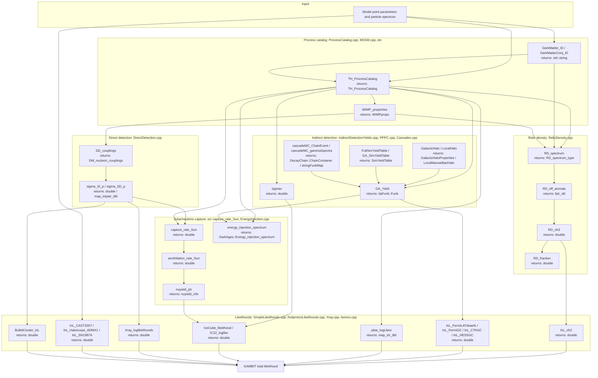

# DarkBit

DarkBit is the GAMBIT module responsible for computing dark matter
observables and likelihoods for a given model point. It builds a
process catalog of dark matter annihilation/decay/scattering channels
from the particle spectrum, then uses that catalog (together with
external backends such as DarkSUSY, MicrOMEGAs, DDCalc, gamLike, and
DarkAges) to predict the relic density, direct-detection scattering
rates, indirect-detection fluxes (gamma-ray, antiproton, neutrino,
CMB energy injection), and other astrophysical/axion signals, finally
combining the predictions with experimental data into log-likelihoods
that feed back into the GAMBIT scan.

Like other GAMBIT modules, DarkBit exposes its functionality through
`CAPABILITY`/`FUNCTION` declarations (see
`include/gambit/DarkBit/DarkBit_rollcall.hpp`); the diagram below shows
how those capabilities are chained together at runtime, with each node
annotated with the C++ return type declared in its `START_FUNCTION(...)`
(or `QUICK_FUNCTION(...)`) macro, rather than the literal call graph.

## Pipeline overview

## Key source locations

| Stage | Key capability | Return type | Files |
|---|---|---|---|
| Process catalog | `TH_ProcessCatalog` | `TH_ProcessCatalog` | `include/gambit/DarkBit/DarkBit_rollcall.hpp`, `src/ProcessCatalog.cpp`, `src/MSSM.cpp`, `src/ScalarSingletDM.cpp`, `src/DiracSingletDM.cpp`, `src/MajoranaSingletDM.cpp`, `src/VectorSingletDM.cpp`, `src/DMEFT.cpp` |
| DM particle identification | `DarkMatter_ID` / `DarkMatterConj_ID` / `WIMP_properties` | `std::string` / `WIMPprops` | `src/DarkBit.cpp`, `src/DarkBit_types.cpp` |
| Relic density | `RD_spectrum` / `RD_oh2` / `RD_fraction` | `RD_spectrum_type` / `double` | `src/RelicDensity.cpp` |
| Indirect detection: gamma-ray yields | `GA_Yield` / `FullSimYieldTable` | `daFunk::Funk` / `SimYieldTable` | `src/IndirectDetectionYields.cpp`, `src/PPPC.cpp` |
| Indirect detection: cascade decays | `cascadeMC_ChainEvent` / `cascadeMC_gammaSpectra` | `DecayChain::ChainContainer` / `stringFunkMap` | `src/Cascades.cpp`, `src/decay_chain.cpp`, `src/SimpleHist.cpp` |
| Halo properties | `GalacticHalo` / `LocalHalo` | `GalacticHaloProperties` / `LocalMaxwellianHalo` | `src/DarkBit.cpp` |
| Direct detection | `DD_couplings` / `sigma_SI_p` / `sigma_SD_p` | `DM_nucleon_couplings` / `double` / `map_intpair_dbl` | `src/DirectDetection.cpp` |
| Solar/Earth capture and neutrino yields | `capture_rate_Sun` / `nuyield_ptr` | `double` / `nuyield_info` | `src/DarkBit.cpp`, `src/SunNeutrinos.cpp` |
| CMB/energy injection | `energy_injection_spectrum` | `DarkAges::Energy_injection_spectrum` | `src/EnergyInjection.cpp` |
| Relic density likelihood | `lnL_oh2` | `double` | `src/SimpleLikelihoods.cpp` |
| Gamma-ray likelihoods | `lnL_FermiLATdwarfs` / `lnL_FermiGC` / `lnL_CTAGC` / `lnL_HESSGC` | `double` | `src/SimpleLikelihoods.cpp` |
| Antiproton likelihood | `pbar_logLikes` | `map_str_dbl` | `src/AntiprotonLikelihoods.cpp` |
| Neutrino telescope likelihoods | `IceCube_likelihood` / `IC22_loglike` | `double` | `src/SimpleLikelihoods.cpp` |
| X-ray likelihoods | `Xray_loglikelihoods` | `double` | `src/Xray.cpp` |
| Axion/ALP likelihoods | `lnL_CAST2007` / `lnL_Haloscope_ADMX1` / `lnL_SN1987A` | `double` | `src/Axions.cpp` |
| Bullet Cluster (self-interaction) likelihood | `BulletCluster_lnL` | `double` | `src/DarkBit.cpp` |

This is a high-level pipeline view, not an exhaustive capability/function
reference — see `include/gambit/DarkBit/DarkBit_rollcall.hpp` for the full
set of `CAPABILITY`/`FUNCTION` declarations and their dependency
requirements.
