# DecayBit

DecayBit is the GAMBIT module responsible for computing particle decay
rates, branching fractions, and decay tables for a given model point. It
covers Standard Model particles (Higgs, W, Z, top, tau, mesons, etc.) as
well as BSM particles such as MSSM sparticles, extra Higgs states,
gravitinos, and dark-sector mediators, then assembles the results into a
global `DecayTable` and a handful of derived likelihoods (Z invisible
width, W leptonic branching ratios, invisible Higgs branching fraction).

Like other GAMBIT modules, DecayBit exposes its functionality through
`CAPABILITY`/`FUNCTION` declarations (see
`include/gambit/DecayBit/DecayBit_rollcall.hpp`), including a number of
particle-specific antiparticle/quick-decay capabilities declared with
`QUICK_FUNCTION`. The diagram below shows how those capabilities are
chained together at runtime, with each node annotated with the C++ return
type declared in its `START_FUNCTION(...)`/`QUICK_FUNCTION(...)` macro,
rather than the literal call graph.

## Pipeline overview

```mermaid
flowchart TD
    subgraph Input["Model point and spectra"]
        Model["Model point parameters"]
        Spec["MSSM_spectrum / SM_spectrum / other Spectrum objects<br/>returns: Spectrum"]
        Pseudo["SLHA_pseudonyms:<br/>get_mass_es_pseudonyms<br/>returns: mass_es_pseudonyms"]
    end

    subgraph SMPart["SM particle decays: quick-function declarations"]
        SMBoson["W_plus_decay_rates / W_minus_decay_rates /<br/>Z_decay_rates<br/>returns: DecayTable::Entry"]
        SMFerm["t_decay_rates / tbar_decay_rates /<br/>mu_plus_minus_decay_rates / tau_plus_minus_decay_rates<br/>returns: DecayTable::Entry"]
        SMMeson["pi, eta, rho, omega decay rates<br/>returns: DecayTable::Entry"]
    end

    subgraph HiggsSec["Higgs sector: DecayBit_rollcall.hpp"]
        RefHiggs["Reference_SM_Higgs_decay_rates:<br/>Ref_SM_Higgs_decays_table /<br/>Ref_SM_Higgs_decays_FeynHiggs<br/>returns: DecayTable::Entry"]
        HiggsRates["Higgs_decay_rates:<br/>SM_Higgs_decays / ScalarSingletDM_Higgs_decays /<br/>VectorSingletDM_Higgs_decays / MSSM_h0_1_decays<br/>returns: DecayTable::Entry"]
        OtherHiggs["h0_2_decay_rates / A0_decay_rates /<br/>H_plus_decay_rates / H_minus_decay_rates<br/>returns: DecayTable::Entry"]
    end

    subgraph MSSMSec["MSSM sparticle decays: SUSY-HIT/FeynHiggs backends"]
        Gluino["gluino_decay_rates<br/>returns: DecayTable::Entry"]
        Squark["stop_1_2, sbottom_1_2, sup, sdown,<br/>scharm, sstrange decay rates<br/>returns: DecayTable::Entry"]
        Slepton["selectron, smuon, stau_1_2,<br/>snu_electronl_muonl_taul decay rates<br/>returns: DecayTable::Entry"]
        Chargino["chargino_plus_1_2_decay_rates<br/>returns: DecayTable::Entry"]
        Neutralino["neutralino_1_2_3_4_decay_rates<br/>returns: DecayTable::Entry"]
        Antiparticles["Antiparticle quick functions:<br/>stopbar, sbottombar, chargino_minus, etc.<br/>returns: DecayTable::Entry"]
    end

    subgraph DarkSec["Dark sector / other BSM decays"]
        Y1["Y1_decay_rates:<br/>CH_DMsimpVectorMed..._Y1_decays<br/>returns: DecayTable::Entry"]
        DarkPhoton["dark_photon_decay_rates:<br/>SubGeVDM_dark_photon_decays<br/>returns: DecayTable::Entry"]
        DPDerived["dark_photon_decay_length /<br/>dark_photon_visible_branching<br/>returns: double"]
    end

    subgraph Aggregate["Decay table aggregation"]
        AllDecays["decay_rates:<br/>all_decays / all_decays_from_SLHA<br/>returns: DecayTable"]
        AllBFs["all_BFs:<br/>get_decaytable_as_map<br/>returns: map_str_dbl"]
    end

    subgraph Checks["Consistency checks and likelihoods"]
        SLHA1["SLHA1_violation:<br/>check_first_sec_gen_mixing<br/>returns: int"]
        ZgammaNu["Z_gamma_nu:<br/>Z_gamma_nu_2l<br/>returns: triplet&lt;double&gt;"]
        ZgammaChi0["Z_gamma_chi_0:<br/>Z_gamma_chi_0_MSSM_tree<br/>returns: triplet&lt;double&gt;"]
        LnLZinv["lnL_Z_inv<br/>returns: double"]
        WtoL["W_to_l_decays:<br/>RHN_W_to_l_decays<br/>returns: std::vector&lt;double&gt;"]
        LnLWdecays["lnL_W_decays:<br/>lnL_W_decays_chi2<br/>returns: double"]
        InvHiggsBF["inv_Higgs_BF:<br/>ScalarSingletDM_inv_Higgs_BF /<br/>MSSM_inv_Higgs_BF<br/>returns: double"]
        LnLHiggsInv["lnL_Higgs_invWidth:<br/>lnL_Higgs_invWidth_SMlike<br/>returns: double"]
    end

    Model --> Spec
    Spec --> Pseudo
    Spec --> SMBoson
    Spec --> RefHiggs
    Pseudo --> HiggsRates
    Pseudo --> MSSMSec
    Spec --> Y1
    Spec --> DarkPhoton

    RefHiggs --> HiggsRates
    HiggsRates --> OtherHiggs
    HiggsRates --> InvHiggsBF
    Spec --> InvHiggsBF
    InvHiggsBF --> LnLHiggsInv

    Pseudo --> Gluino
    Pseudo --> Squark
    Pseudo --> Slepton
    Pseudo --> Chargino
    Pseudo --> Neutralino
    Squark --> Antiparticles
    Slepton --> Antiparticles
    Chargino --> Antiparticles

    DarkPhoton --> DPDerived

    SMBoson --> AllDecays
    SMFerm --> AllDecays
    SMMeson --> AllDecays
    HiggsRates --> AllDecays
    OtherHiggs --> AllDecays
    Gluino --> AllDecays
    Squark --> AllDecays
    Slepton --> AllDecays
    Chargino --> AllDecays
    Neutralino --> AllDecays
    Antiparticles --> AllDecays
    Y1 --> AllDecays
    DarkPhoton --> AllDecays
    AllDecays --> AllBFs

    Spec --> SLHA1
    Spec --> ZgammaNu
    Spec --> ZgammaChi0
    ZgammaNu --> LnLZinv
    ZgammaChi0 --> LnLZinv
    SMBoson --> WtoL
    WtoL --> LnLWdecays
    SMBoson --> LnLWdecays
```

## Key source locations

| Stage | Key capability | Return type | Files |
|---|---|---|---|
| Spectrum and pseudonyms | `SLHA_pseudonyms` | `mass_es_pseudonyms` | `include/gambit/DecayBit/DecayBit_rollcall.hpp`, `src/DecayBit.cpp` |
| SM particle decays | `W_plus_decay_rates` / `Z_decay_rates` / `t_decay_rates` (representative) | `DecayTable::Entry` | `include/gambit/DecayBit/DecayBit_rollcall.hpp` (`QUICK_FUNCTION` block), `src/DecayBit.cpp` |
| Higgs sector | `Higgs_decay_rates` / `Reference_SM_Higgs_decay_rates` | `DecayTable::Entry` | `include/gambit/DecayBit/DecayBit_rollcall.hpp`, `src/DecayBit.cpp` |
| Other Higgs states | `h0_2_decay_rates` / `A0_decay_rates` / `H_plus_decay_rates` | `DecayTable::Entry` | `include/gambit/DecayBit/DecayBit_rollcall.hpp`, `src/DecayBit.cpp` |
| MSSM sparticle decays | `gluino_decay_rates` / `stop_1_decay_rates` / `neutralino_1_decay_rates` (representative) | `DecayTable::Entry` | `include/gambit/DecayBit/DecayBit_rollcall.hpp`, `src/DecayBit.cpp` (SUSY-HIT/FeynHiggs backend calls) |
| MSSM antiparticle decays | `stopbar_1_decay_rates` / `chargino_minus_1_decay_rates` (representative) | `DecayTable::Entry` | `include/gambit/DecayBit/DecayBit_rollcall.hpp` (`QUICK_FUNCTION` block) |
| Dark sector decays | `Y1_decay_rates` / `dark_photon_decay_rates` | `DecayTable::Entry` | `include/gambit/DecayBit/DecayBit_rollcall.hpp`, `src/DecayBit.cpp` |
| Dark photon derived observables | `dark_photon_decay_length` / `dark_photon_visible_branching` | `double` | `include/gambit/DecayBit/DecayBit_rollcall.hpp`, `src/DecayBit.cpp` |
| Decay table aggregation | `decay_rates` / `all_BFs` | `DecayTable` / `map_str_dbl` | `include/gambit/DecayBit/DecayBit_rollcall.hpp`, `src/DecayBit.cpp` |
| SLHA consistency checks | `SLHA1_violation` | `int` | `include/gambit/DecayBit/DecayBit_rollcall.hpp`, `src/DecayBit.cpp` |
| Z invisible width likelihood | `Z_gamma_nu` / `Z_gamma_chi_0` / `lnL_Z_inv` | `triplet<double>` / `double` | `include/gambit/DecayBit/DecayBit_rollcall.hpp`, `src/DecayBit.cpp` |
| W leptonic decay likelihood | `W_to_l_decays` / `lnL_W_decays` | `std::vector<double>` / `double` | `include/gambit/DecayBit/DecayBit_rollcall.hpp`, `src/DecayBit.cpp` |
| Invisible Higgs branching likelihood | `inv_Higgs_BF` / `lnL_Higgs_invWidth` | `double` | `include/gambit/DecayBit/DecayBit_rollcall.hpp`, `src/DecayBit.cpp` |
| Utility/helper functions | decay-table-related helpers | various | `src/decay_utils.cpp` |

This is a high-level pipeline view, not an exhaustive capability/function
reference — see `DecayBit_rollcall.hpp` for the full set of
`CAPABILITY`/`FUNCTION`/`QUICK_FUNCTION` declarations and their dependency
requirements.
