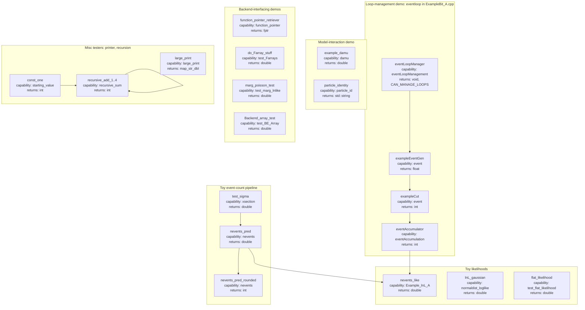

# ExampleBit_A

ExampleBit_A is GAMBIT's tutorial/example module. It does not compute any
real physics; instead, each capability is a small, self-contained
demonstration of a GAMBIT module-writing feature - declaring observables and
likelihoods, expressing dependencies, interacting with scan models, managing
event loops, retrieving backend function pointers, calling Fortran common
blocks via Farray overlays, and chaining capabilities recursively. New
GAMBIT module authors are meant to read this module's rollcall header and
source file side by side as a worked reference before writing their own
module.

Like other GAMBIT modules, ExampleBit_A exposes its functionality through
`CAPABILITY`/`FUNCTION` declarations (see
`include/gambit/ExampleBit_A/ExampleBit_A_rollcall.hpp`); the diagram below
shows how those capabilities are chained together at runtime, with each node
annotated with the C++ return type declared in its `START_FUNCTION(...)`
macro, rather than the literal call graph.

## Pipeline overview

## Key source locations

| Stage | Key capability | Return type | Files |
|---|---|---|---|
| Toy cross-section / event-count pipeline | `xsection` / `nevents` | `double` / `int` | `include/gambit/ExampleBit_A/ExampleBit_A_rollcall.hpp`, `src/ExampleBit_A.cpp` |
| Loop-management demo | `eventLoopManagement` / `event` / `eventAccumulation` | `void, CAN_MANAGE_LOOPS` / `float`,`int` / `int` | `include/gambit/ExampleBit_A/ExampleBit_A_rollcall.hpp`, `src/ExampleBit_A.cpp` |
| Toy likelihoods | `Example_lnL_A` / `normaldist_loglike` / `test_flat_likelihood` | `double` | `include/gambit/ExampleBit_A/ExampleBit_A_rollcall.hpp`, `src/ExampleBit_A.cpp` |
| Model-interaction demo | `damu` / `particle_id` | `double` / `std::string` | `include/gambit/ExampleBit_A/ExampleBit_A_rollcall.hpp`, `src/ExampleBit_A.cpp` |
| Backend pointer/array/common-block demos | `function_pointer` / `test_Farrays` / `test_marg_lnlike` / `test_BE_Array` | `fptr` / `double` | `include/gambit/ExampleBit_A/ExampleBit_A_rollcall.hpp`, `src/ExampleBit_A.cpp` |
| Printer-buffer stress test | `large_print` | `map_str_dbl` | `include/gambit/ExampleBit_A/ExampleBit_A_rollcall.hpp`, `src/ExampleBit_A.cpp` |
| Recursive dependency-chain demo | `starting_value` / `recursive_sum` | `int` | `include/gambit/ExampleBit_A/ExampleBit_A_rollcall.hpp`, `src/ExampleBit_A.cpp` |

This is a high-level pipeline view, not an exhaustive capability/function
reference - see `include/gambit/ExampleBit_A/ExampleBit_A_rollcall.hpp` for
the full set of `CAPABILITY`/`FUNCTION` declarations and their dependency
requirements.
