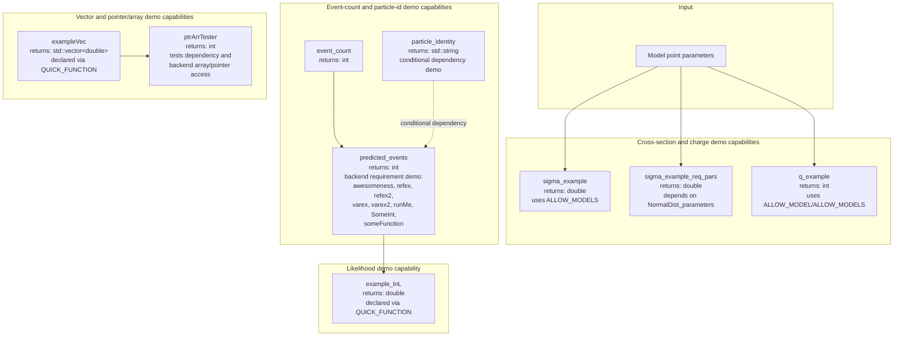

# ExampleBit_B

ExampleBit_B is GAMBIT's tutorial/example module. It does not compute any
real physics; instead it demonstrates, in a single small module, the full
range of mechanics a GAMBIT module author can use: declaring observables
and likelihoods, depending on model parameters either via `ALLOW_MODELS`
or via an ordinary `DEPENDENCY`, declaring ordinary and conditional
dependencies, requiring backend functions (including variadic ones,
ones passed by reference, and ones passed as function pointers),
activating backend requirements only for certain models or backend
versions, and using the `QUICK_FUNCTION` shorthand to declare simple
capabilities in one line. It is meant to be read alongside the GAMBIT
module-writing documentation as a worked example, not used in a real
scan.

Like other GAMBIT modules, ExampleBit_B exposes its functionality through
`CAPABILITY`/`FUNCTION` declarations (see
`include/gambit/ExampleBit_B/ExampleBit_B_rollcall.hpp`); the diagram
below shows how those capabilities are chained together at runtime, with
each node annotated with the C++ return type declared in its
`START_FUNCTION(...)` (or `QUICK_FUNCTION(...)`) macro, rather than the
literal call graph.

## Pipeline overview

## Key source locations

| Stage | Key capability | Return type | Files |
|---|---|---|---|
| Cross-section demo | `xsection` / `sigma_example` | `double` | `include/gambit/ExampleBit_B/ExampleBit_B_rollcall.hpp`, `src/ExampleBit_B.cpp` |
| Cross-section demo, dependency-based | `xsection` / `sigma_example_req_pars` | `double` | same as above |
| Charge demo | `charge` / `q_example` | `int` | same as above |
| Event-count demo | `nevents` / `event_count` | `int` | same as above |
| Particle-id demo, conditional dependency | `particle_id` / `particle_identity` | `std::string` | same as above |
| Post-cut events demo, backend requirements | `nevents_postcuts` / `predicted_events` | `int` | same as above |
| Vector-returning demo, declared via QUICK_FUNCTION | `test_vector` / `exampleVec` | `std::vector<double>` | same as above |
| Pointer/array access demo | `ptr_arr_tests` / `ptrArrTester` | `int` | same as above |
| Likelihood demo, declared via QUICK_FUNCTION | `Example_lnL_B` / `example_lnL` | `double` | same as above |

This is a high-level pipeline view, not an exhaustive capability/function
reference — see `include/gambit/ExampleBit_B/ExampleBit_B_rollcall.hpp`
for the full set of `CAPABILITY`/`FUNCTION` declarations, including the
backend-requirement, conditional-dependency, and model-activation
examples, and their dependency requirements.
