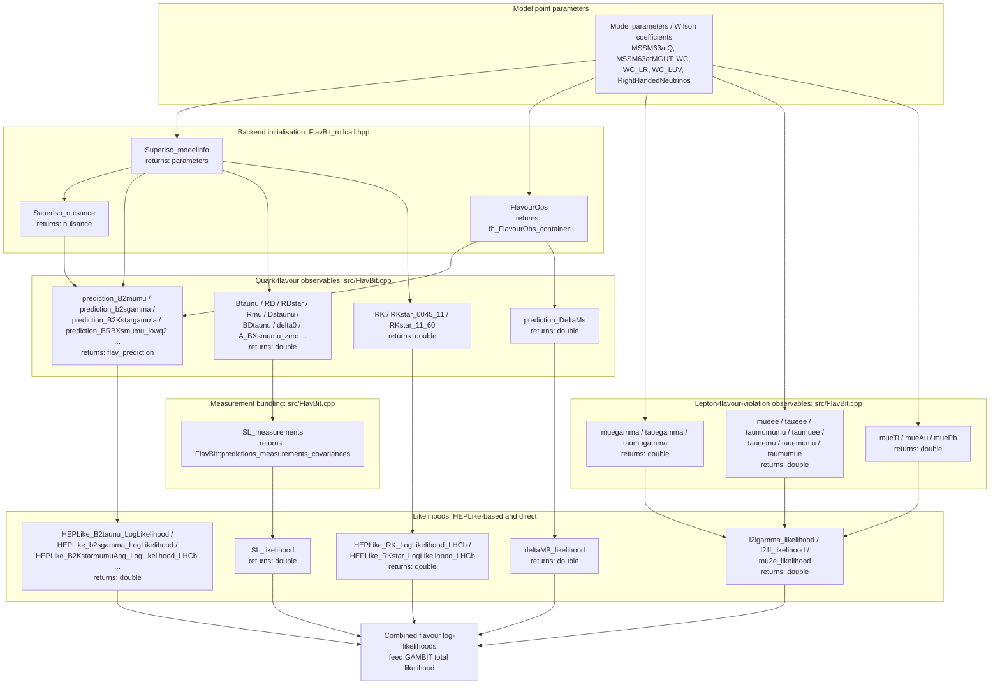

# FlavBit

FlavBit is the GAMBIT module responsible for computing flavour-physics
observables and likelihoods for a given model point. It uses the SuperIso
and FeynHiggs backends to turn model parameters (or Wilson coefficients)
into B-, D-, and K-meson decay observables, and lepton-flavour-violation
(LFV) observables driven by right-handed neutrino mixing, then combines
these with experimental measurements via the HEPLike backend to produce
log-likelihoods that feed back into the GAMBIT scan.

Like other GAMBIT modules, FlavBit exposes its functionality through
`CAPABILITY`/`FUNCTION` declarations (see
`include/gambit/FlavBit/FlavBit_rollcall.hpp`); the diagram below shows
how those capabilities are chained together at runtime, with each node
annotated with the C++ return type declared in its `START_FUNCTION(...)`
macro, rather than the literal call graph.

## Pipeline overview

## Key source locations

| Stage | Key capability | Return type | Files |
|---|---|---|---|
| Backend initialisation | `SuperIso_modelinfo` / `SuperIso_nuisance` | `parameters` / `nuisance` | `include/gambit/FlavBit/FlavBit_rollcall.hpp`, `src/FlavBit.cpp` |
| FeynHiggs flavour container | `FlavourObs` | `fh_FlavourObs_container` | `include/gambit/FlavBit/FlavBit_rollcall.hpp`, `src/FlavBit.cpp` |
| B/D/K meson decay predictions | `prediction_B2mumu`, `prediction_b2sgamma`, `prediction_B2Kstargamma`, `prediction_BRBXsmumu_lowq2`/`highq2`, `prediction_B2KstarmumuAng_*`, `prediction_B2KmumuBr_*`, `prediction_Bs2phimumuBr_*` | `flav_prediction` | `include/gambit/FlavBit/FlavBit_rollcall.hpp`, `src/FlavBit.cpp` |
| Simple tree-level/loop observables | `Btaunu`, `RD`, `RDstar`, `Rmu`, `Rmu23`, `Dstaunu`, `Dsmunu`, `Dmunu`, `BDtaunu`, `BDmunu`, `BDstartaunu`, `BDstarmunu`, `delta0`, `A_BXsmumu_zero` | `double` | `include/gambit/FlavBit/FlavBit_rollcall.hpp`, `src/FlavBit.cpp` |
| Bs mixing observable | `prediction_DeltaMs` | `double` | `include/gambit/FlavBit/FlavBit_rollcall.hpp`, `src/FlavBit.cpp` |
| RK/RK* convenience observables | `RK`, `RKstar_0045_11`, `RKstar_11_60` | `double` | `include/gambit/FlavBit/FlavBit_rollcall.hpp`, `src/FlavBit.cpp` |
| Lepton-flavour-violation observables | `muegamma`, `tauegamma`, `taumugamma`, `mueee`, `taueee`, `taumumumu`, `mueTi`, `mueAu`, `muePb` | `double` | `include/gambit/FlavBit/FlavBit_rollcall.hpp`, `src/FlavBit.cpp` |
| Measurement bundling | `SL_M` | `FlavBit::predictions_measurements_covariances` | `include/gambit/FlavBit/FlavBit_rollcall.hpp`, `src/FlavBit.cpp` |
| Tree-level semi-leptonic likelihood | `SL_LL` | `double` | `include/gambit/FlavBit/FlavBit_rollcall.hpp`, `src/FlavBit.cpp` |
| Bs mass-difference likelihood | `deltaMB_LL` | `double` | `include/gambit/FlavBit/FlavBit_rollcall.hpp`, `src/FlavBit.cpp` |
| HEPLike B/K decay likelihoods | `B2taunu_LogLikelihood`, `b2sgamma_LogLikelihood`, `B2Kstargamma_LogLikelihood`, `B2mumu_LogLikelihood_LHCb`/`CMS`/`Atlas`, `B2KstarmumuAng_LogLikelihood_*`, `B2KstarmumuBr_LogLikelihood_LHCb`, `B2KmumuBr_LogLikelihood_LHCb`, `Bs2phimumuBr_LogLikelihood` | `double` | `include/gambit/FlavBit/FlavBit_rollcall.hpp`, `src/FlavBit.cpp` |
| RK/RK* likelihoods | `RK_LogLikelihood_LHCb`, `RKstar_LogLikelihood_LHCb` | `double` | `include/gambit/FlavBit/FlavBit_rollcall.hpp`, `src/FlavBit.cpp` |
| LFV likelihoods | `l2lgamma_lnL`, `l2lll_lnL`, `mu2e_lnL` | `double` | `include/gambit/FlavBit/FlavBit_rollcall.hpp`, `src/FlavBit.cpp` |
| Ancillary data reading | n/a | n/a | `src/Flav_reader.cpp` |

This is a high-level pipeline view, not an exhaustive capability/function
reference — see `FlavBit_rollcall.hpp` for the full set of
`CAPABILITY`/`FUNCTION` declarations and their dependency requirements.
