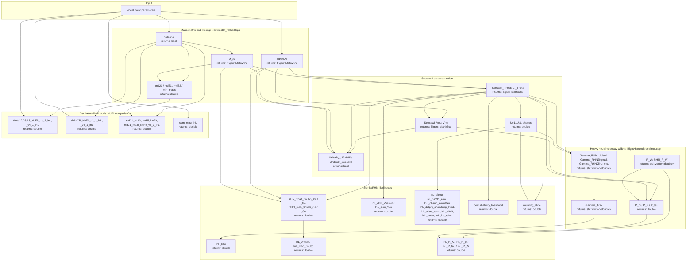

# NeutrinoBit

NeutrinoBit is the GAMBIT module responsible for neutrino physics. It
constructs the active-neutrino mass matrix and PMNS mixing matrix from a
given model point, derives oscillation parameters and mass-squared
splittings, and - for models with right-handed/sterile neutrinos - builds
the seesaw mixing/Theta matrix, the resulting heavy-neutrino active-flavour
mixings and decay widths, and combines all of this with experimental data
into log-likelihoods (oscillation global fits, neutrinoless double-beta
decay, BBN, peak-search and collider/beam-dump bounds on sterile neutrinos).

Like other GAMBIT modules, NeutrinoBit exposes its functionality through
`CAPABILITY`/`FUNCTION` declarations (see
`include/gambit/NeutrinoBit/NeutrinoBit_rollcall.hpp`); the diagram below
shows how those capabilities are chained together at runtime, with each
node annotated with the C++ return type declared in its `START_FUNCTION(...)`
macro, rather than the literal call graph.

## Pipeline overview

## Key source locations

| Stage | Key capability | Return type | Files |
|---|---|---|---|
| Mass matrix / ordering | `ordering` / `m_nu` | `bool` / `Eigen::Matrix3cd` | `include/gambit/NeutrinoBit/NeutrinoBit_rollcall.hpp`, `src/NeutrinoBit.cpp` |
| Mass splittings | `md21` / `md31` / `md32` / `min_mass` | `double` | same as above |
| PMNS mixing matrix | `UPMNS` | `Eigen::Matrix3cd` | `include/gambit/NeutrinoBit/NeutrinoBit_rollcall.hpp`, `src/NeutrinoBit.cpp` |
| Seesaw I parametrization | `SeesawI_Theta` / `SeesawI_Vnu` | `Eigen::Matrix3cd` | `include/gambit/NeutrinoBit/NeutrinoBit_rollcall.hpp`, `src/RightHandedNeutrinos.cpp` |
| Unitarity checks | `Unitarity_UPMNS` / `Unitarity_SeesawI` | `bool` | `src/RightHandedNeutrinos.cpp` |
| Heavy-light flavour mixings | `Ue1`..`Ut3` and phases | `double` | `src/RightHandedNeutrinos.cpp` |
| RHN partial decay widths | `Gamma_RHN2piplusl`, `Gamma_RHN2llnu`, etc. | `std::vector<double>` | `src/RightHandedNeutrinos.cpp` |
| BBN constraint | `Gamma_BBN` / `lnL_bbn` | `std::vector<double>` / `double` | `src/RightHandedNeutrinos.cpp` |
| Meson decay ratios | `R_pi` / `R_K` / `R_tau` / `R_W` | `double` / `std::vector<double>` | `src/RightHandedNeutrinos.cpp` |
| Neutrinoless double-beta decay | `RHN_Thalf_0nubb_Xe` / `_Ge`, `RHN_mbb_0nubb_Xe` / `_Ge` | `double` | `src/RightHandedNeutrinos.cpp` |
| 0nubb combined likelihoods | `lnL_0nubb` / `lnL_mbb_0nubb` | `double` | `src/RightHandedNeutrinos.cpp` |
| CKM unitarity / Vus | `calc_Vus`, `lnL_ckm_Vusmin`, `lnL_ckm_Vus` | `double` | `src/RightHandedNeutrinos.cpp` |
| Beam-dump / collider peak searches | `lnL_pienu`, `lnL_ps191_e`/`_mu`, `lnL_charm_e`/`_mu`/`_tau`, `lnL_delphi_short_lived`/`_long_lived`, `lnL_atlas_e`/`_mu`, `lnL_e949`, `lnL_nutev`, `lnL_lhc_e`/`_mu` | `double` | `src/RightHandedNeutrinos.cpp` |
| Theory consistency | `perturbativity_likelihood`, `coupling_slide` | `double` | `src/RightHandedNeutrinos.cpp` |
| Oscillation global-fit likelihoods | `theta12`/`theta23`/`theta13`/`deltaCP`_NuFit_v3_2_lnL / _v4_1_lnL, `md21`/`md3l`_NuFit_lnL, `sum_mnu_lnL` | `double` | `include/gambit/NeutrinoBit/NeutrinoBit_rollcall.hpp`, `src/NeutrinoBit.cpp`, `include/gambit/NeutrinoBit/NeutrinoInterpolator.hpp` |

This is a high-level pipeline view, not an exhaustive capability/function
reference — see `NeutrinoBit_rollcall.hpp` for the full set of
`CAPABILITY`/`FUNCTION` declarations and their dependency requirements.
