# ObjectivesBit

ObjectivesBit is the GAMBIT module that provides synthetic, analytically
known test functions for benchmarking scanners and samplers. Rather than
computing a physical likelihood from data, each capability evaluates a
closed-form mathematical "objective" (Gaussian, Rosenbrock, Himmelblau,
Ackley, Rastrigin, and similar standard optimisation/inference test
functions) directly from the model parameters of the `trivial_Nd` test
models, and reports it as a log-likelihood. These functions are widely used
in the optimisation and nested-sampling literature for stress-testing how
well a scanning algorithm explores multi-modal, ill-conditioned, or
high-dimensional parameter spaces.

Like other GAMBIT modules, ObjectivesBit exposes its functionality through
`CAPABILITY`/`FUNCTION` declarations (see
`include/gambit/ObjectivesBit/ObjectivesBit_rollcall.hpp`); the diagram below
shows how those capabilities are chained together at runtime, with each node
annotated with the C++ return type declared in its `START_FUNCTION(...)`
macro, rather than the literal call graph.

## Pipeline overview

```mermaid
flowchart TD
    subgraph Input["Input: trivial_Nd model parameters"]
        Model["Model point parameters<br/>x1...xN"]
    end

    subgraph Helper["Argument extraction: src/ObjectivesBit.cpp"]
        GetArgs["get_arguments:<br/>collects x1...xN from Param map<br/>returns: std::vector&lt;double&gt;"]
    end

    subgraph Smooth["Smooth/unimodal test functions"]
        Gaussian["gaussian<br/>returns: double"]
        Rosenbrock["rosenbrock<br/>returns: double"]
        Beale["beale<br/>returns: double"]
        StyblinskiTang["styblinski_tang<br/>returns: double"]
    end

    subgraph Multimodal["Multimodal/2D test functions"]
        Himmelblau["himmelblau<br/>returns: double"]
        McCormick["mccormick<br/>returns: double"]
        Easom["easom<br/>returns: double"]
    end

    subgraph Oscillatory["Oscillatory/multimodal high-dim functions"]
        Ackley["ackley<br/>returns: double"]
        Rastrigin["rastrigin<br/>returns: double"]
        Eggbox["eggbox<br/>returns: double"]
        Shells["shells<br/>returns: double"]
    end

    subgraph Analytic["Analytic test functions: arXiv 2101.04525"]
        TF1["tf1<br/>returns: double"]
        TF2["tf2<br/>returns: double"]
        TF3["tf3<br/>returns: double"]
        TF4["tf4<br/>returns: double"]
    end

    Output["loglike: double<br/>feeds GAMBIT total likelihood"]

    Model --> GetArgs
    GetArgs --> Gaussian
    GetArgs --> Rosenbrock
    GetArgs --> Beale
    GetArgs --> StyblinskiTang
    GetArgs --> Himmelblau
    GetArgs --> McCormick
    GetArgs --> Easom
    GetArgs --> Ackley
    GetArgs --> Rastrigin
    GetArgs --> Eggbox
    GetArgs --> Shells
    GetArgs --> TF1
    GetArgs --> TF2
    GetArgs --> TF3
    GetArgs --> TF4

    Gaussian --> Output
    Rosenbrock --> Output
    Beale --> Output
    StyblinskiTang --> Output
    Himmelblau --> Output
    McCormick --> Output
    Easom --> Output
    Ackley --> Output
    Rastrigin --> Output
    Eggbox --> Output
    Shells --> Output
    TF1 --> Output
    TF2 --> Output
    TF3 --> Output
    TF4 --> Output
```

## Key source locations

| Stage | Key capability | Return type | Files |
|---|---|---|---|
| Argument extraction | `get_arguments` helper, used by all functions below | `std::vector<double>` | `src/ObjectivesBit.cpp` |
| Smooth/unimodal test functions | `gaussian`, `rosenbrock`, `beale`, `styblinski_tang` | `double` | `include/gambit/ObjectivesBit/ObjectivesBit_rollcall.hpp`, `src/ObjectivesBit.cpp` |
| Multimodal 2D test functions | `himmelblau`, `mccormick`, `easom` | `double` | `include/gambit/ObjectivesBit/ObjectivesBit_rollcall.hpp`, `src/ObjectivesBit.cpp` |
| Oscillatory/multimodal high-dim functions | `ackley`, `rastrigin`, `eggbox`, `shells` | `double` | `include/gambit/ObjectivesBit/ObjectivesBit_rollcall.hpp`, `src/ObjectivesBit.cpp` |
| Analytic test functions, arXiv 2101.04525 | `tf1`, `tf2`, `tf3`, `tf4` | `double` | `include/gambit/ObjectivesBit/ObjectivesBit_rollcall.hpp`, `src/ObjectivesBit.cpp` |
| Model coverage | `ALLOW_MODELS` lists for `trivial_1d` through `trivial_10d` | n/a | `include/gambit/ObjectivesBit/ObjectivesBit_rollcall.hpp` |

This is a high-level pipeline view, not an exhaustive capability/function
reference — see `ObjectivesBit_rollcall.hpp` for the full set of
`CAPABILITY`/`FUNCTION` declarations and their allowed models.
