# PrecisionBit

PrecisionBit is the GAMBIT module responsible for computing precision
observables and their likelihoods for a given model point, mostly in the
electroweak sector. It builds precision-improved mass spectra, extracts
quantities like the W boson mass, the effective leptonic weak mixing angle,
muon g-2, electric dipole moments, and basic Standard Model nuisance
parameters, and turns these into log-likelihood contributions that feed back
into the GAMBIT total likelihood.

Like other GAMBIT modules, PrecisionBit exposes its functionality through
`CAPABILITY`/`FUNCTION` declarations (see
`include/gambit/PrecisionBit/PrecisionBit_rollcall.hpp`); the diagram below
shows how those capabilities are chained together at runtime, with each node
annotated with the C++ return type declared in its `START_FUNCTION(...)` or
`QUICK_FUNCTION(...)` macro, rather than the literal call graph.

## Pipeline overview

```mermaid
flowchart TD
    subgraph Input
        Model[Model point parameters]
        Unimp["unimproved_MSSM_spectrum / SM_spectrum<br/>returns: Spectrum"]
    end

    subgraph BackendObs["Backend precision observables"]
        FHObs["FeynHiggs_PrecisionObs<br/>returns: fh_PrecisionObs_container"]
        SPObs["SP_PrecisionObs<br/>returns: double"]
    end

    subgraph Extractors["FeynHiggs observable extractors"]
        FHgm2["FeynHiggs_precision_gm2<br/>returns: triplet&lt;double&gt;"]
        FHdrho["FeynHiggs_precision_deltarho<br/>returns: triplet&lt;double&gt;"]
        FHmw["FeynHiggs_precision_mw<br/>returns: triplet&lt;double&gt;"]
        FHsinW2["FeynHiggs_precision_sinW2<br/>returns: triplet&lt;double&gt;"]
        FHedm["FeynHiggs_precision_edm_e / edm_n / edm_hg<br/>returns: double"]
    end

    subgraph SpectrumPrec["Precision MSSM spectrum: MSSM_spectrum"]
        SpecAll["make_MSSM_precision_spectrum_4H_W<br/>returns: Spectrum"]
        SpecHW["make_MSSM_precision_spectrum_H_W<br/>returns: Spectrum"]
        SpecH["make_MSSM_precision_spectrum_H<br/>returns: Spectrum"]
        SpecW["make_MSSM_precision_spectrum_W<br/>returns: Spectrum"]
        SpecNone["make_MSSM_precision_spectrum_none<br/>returns: Spectrum"]
    end

    subgraph MassExtract["Mass extractors: mw / mh"]
        MW["mw_from_SM_spectrum / mw_from_MSSM_spectrum / etc<br/>returns: triplet&lt;double&gt;"]
        MH["mh_from_SM_spectrum / mh_from_MSSM_spectrum / etc<br/>returns: triplet&lt;double&gt;"]
    end

    subgraph Gm2["Muon g-2: muon_gm2 / muon_gm2_SM"]
        SI["SuperIso_muon_gm2<br/>returns: triplet&lt;double&gt;"]
        GM2C["GM2C_SUSY<br/>returns: triplet&lt;double&gt;"]
        SMee["gm2_SM_ee<br/>returns: triplet&lt;double&gt;"]
        SMtautau["gm2_SM_tautau<br/>returns: triplet&lt;double&gt;"]
    end

    subgraph RHN["Heavy-neutrino EWPO corrections"]
        RHNsinW2["RHN_sinW2_eff<br/>returns: triplet&lt;double&gt;"]
        RHNmw["RHN_mw<br/>returns: triplet&lt;double&gt;"]
    end

    subgraph Nuisance["SM nuisance and other likelihoods"]
        SMNuis["lnL_Z_mass / lnL_t_mass / lnL_mbmb / lnL_mcmc /<br/>lnL_alpha_em / lnL_alpha_s / lnL_GF / lnL_light_quark_masses<br/>returns: double"]
        MtRun["lnL_mtrun<br/>returns: double"]
        Neutron["lnL_neutron_lifetime_beam_Yue /<br/>lnL_neutron_lifetime_bottle_PDG19<br/>returns: double"]
    end

    subgraph LL["Precision likelihoods"]
        LLwmass["lnL_W_mass<br/>returns: double"]
        LLhmass["lnL_h_mass<br/>returns: double"]
        LLsinW2["lnL_sinW2_eff<br/>returns: double"]
        LLgm2["lnL_gm2<br/>returns: double"]
        LLdrho["lnL_deltarho<br/>returns: double"]
    end

    Output["Combined GAMBIT likelihood"]

    Model --> FHObs
    Model --> SPObs
    Model --> Unimp
    FHObs --> FHgm2
    FHObs --> FHdrho
    FHObs --> FHmw
    FHObs --> FHsinW2
    FHObs --> FHedm

    Unimp --> SpecAll
    FHmw --> SpecAll
    FHmw --> SpecHW
    FHmw --> SpecW
    Unimp --> SpecHW
    Unimp --> SpecH
    Unimp --> SpecW
    Unimp --> SpecNone

    Unimp --> MW
    Unimp --> MH
    SpecAll --> MW
    SpecHW --> MW
    SpecH --> MH
    SpecW --> MW

    Model --> SI
    SpecAll --> GM2C
    Model --> SMee
    Model --> SMtautau

    Model --> RHNsinW2
    RHNsinW2 --> RHNmw

    Model --> SMNuis
    Model --> MtRun
    Model --> Neutron

    MW --> LLwmass
    MH --> LLhmass
    FHsinW2 --> LLsinW2
    RHNsinW2 --> LLsinW2
    SI --> LLgm2
    GM2C --> LLgm2
    SMee --> LLgm2
    SMtautau --> LLgm2
    FHdrho --> LLdrho

    LLwmass --> Output
    LLhmass --> Output
    LLsinW2 --> Output
    LLgm2 --> Output
    LLdrho --> Output
    SPObs --> Output
    FHedm --> Output
    SMNuis --> Output
    MtRun --> Output
    Neutron --> Output
```

## Key source locations

| Stage | Key capability | Return type | Files |
|---|---|---|---|
| Backend precision observables | `Precision` (`FeynHiggs_PrecisionObs`) | `fh_PrecisionObs_container` | `include/gambit/PrecisionBit/PrecisionBit_rollcall.hpp`, `src/PrecisionBit.cpp` |
| Backend precision observables | `SP_PrecisionObs` | `double` | same as above |
| FeynHiggs observable extractors | `muon_gm2` / `deltarho` / `prec_mw` / `prec_sinW2_eff` / `edm_e` / `edm_n` / `edm_hg` | `triplet<double>` / `double` | `include/gambit/PrecisionBit/PrecisionBit_rollcall.hpp` (`QUICK_FUNCTION` entries) |
| Precision MSSM spectrum | `MSSM_spectrum` | `Spectrum` | `include/gambit/PrecisionBit/PrecisionBit_rollcall.hpp`, `src/PrecisionBit.cpp` |
| Mass extractors | `mw` / `mh` | `triplet<double>` | `include/gambit/PrecisionBit/PrecisionBit_rollcall.hpp` (`QUICK_FUNCTION` entries) |
| Muon g-2 | `muon_gm2` (`SuperIso_muon_gm2`, `GM2C_SUSY`) | `triplet<double>` | `src/PrecisionBit.cpp` |
| Muon g-2, SM contribution | `muon_gm2_SM` (`gm2_SM_ee`, `gm2_SM_tautau`) | `triplet<double>` | `src/PrecisionBit.cpp` |
| Heavy-neutrino EWPO corrections | `prec_sinW2_eff` (`RHN_sinW2_eff`) / `mw` (`RHN_mw`) | `triplet<double>` | `src/PrecisionBit.cpp` |
| SM nuisance likelihoods | `lnL_Z_mass`, `lnL_t_mass`, `lnL_mbmb`, `lnL_mcmc`, `lnL_alpha_em`, `lnL_alpha_s`, `lnL_GF`, `lnL_light_quark_masses` | `double` | `include/gambit/PrecisionBit/PrecisionBit_rollcall.hpp` (`QUICK_FUNCTION` entries) |
| Top quark running mass likelihood | `lnL_mtrun` | `double` | `include/gambit/PrecisionBit/PrecisionBit_rollcall.hpp`, `src/PrecisionBit.cpp` |
| Neutron lifetime likelihoods | `lnL_neutron_lifetime_beam` / `lnL_neutron_lifetime_bottle` | `double` | `include/gambit/PrecisionBit/PrecisionBit_rollcall.hpp`, `src/PrecisionBit.cpp` |
| Electroweak precision likelihoods | `lnL_W_mass`, `lnL_h_mass`, `lnL_sinW2_eff`, `lnL_gm2`, `lnL_deltarho` | `double` | `include/gambit/PrecisionBit/PrecisionBit_rollcall.hpp`, `src/PrecisionBit.cpp` |

This is a high-level pipeline view, not an exhaustive capability/function
reference — see `PrecisionBit_rollcall.hpp` for the full set of
`CAPABILITY`/`FUNCTION` declarations and their dependency requirements.
