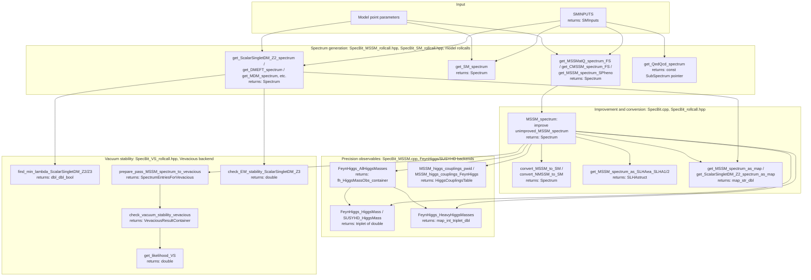

# SpecBit

SpecBit is the GAMBIT module responsible for generating particle mass
spectra for a given model point. It links model input parameters to
spectrum-generator backends (FlexibleSUSY, SPheno, SoftSUSY, SUSYHD,
FeynHiggs, etc.), wraps the results in GAMBIT's standard `Spectrum`
object, and derives quantities such as precision Higgs masses, Higgs
couplings, and electroweak/high-scale vacuum stability from those
spectra. Almost every other module that needs particle masses, mixings,
or decay information ultimately depends on a `Spectrum` object produced
by SpecBit.

Like other GAMBIT modules, SpecBit exposes its functionality through
`CAPABILITY`/`FUNCTION` declarations (see `include/gambit/SpecBit/*_rollcall.hpp`);
the diagram below shows how those capabilities are chained together at
runtime, with each node annotated with the C++ return type declared in its
`START_FUNCTION(...)` macro, rather than the literal call graph.

## Pipeline overview

## Key source locations

| Stage | Key capability | Return type | Files |
|---|---|---|---|
| SM inputs | `SMINPUTS` | `SMInputs` | `include/gambit/SpecBit/SpecBit_SM_rollcall.hpp`, `src/SpecBit_SM.cpp` |
| MSSM spectrum generation | `unimproved_MSSM_spectrum` | `Spectrum` | `include/gambit/SpecBit/SpecBit_MSSM_rollcall.hpp`, `src/SpecBit_MSSM.cpp`, `src/MSSMspec.cpp` |
| SM spectrum generation | `SM_spectrum` | `Spectrum` | `include/gambit/SpecBit/SpecBit_SM_rollcall.hpp`, `src/SpecBit_SM.cpp`, `src/QedQcdWrapper.cpp` |
| BSM/DM model spectra | `ScalarSingletDM_Z2_spectrum` / `VectorSingletDM_Z2_spectrum` / `DMEFT_spectrum` / `MDM_spectrum` (representative) | `Spectrum` | `include/gambit/SpecBit/SpecBit_ScalarSingletDM_rollcall.hpp`, `SpecBit_VectorSingletDM_rollcall.hpp`, `SpecBit_DMEFT_rollcall.hpp`, `SpecBit_MDM_rollcall.hpp`, corresponding `src/SpecBit_*.cpp` |
| Spectrum improvement/conversion | `MSSM_spectrum` / `SM_spectrum` via `convert_MSSM_to_SM` | `Spectrum` | `include/gambit/SpecBit/SpecBit_rollcall.hpp`, `src/SpecBit.cpp` |
| Spectrum serialisation | `get_MSSM_spectrum_as_SLHAea_SLHA1` / `_SLHA2` | `SLHAstruct` | `include/gambit/SpecBit/SpecBit_MSSM_rollcall.hpp`, `src/SpecBit_MSSM.cpp` |
| Spectrum printing | `get_MSSM_spectrum_as_map` / `get_ScalarSingletDM_Z2_spectrum_as_map` | `map_str_dbl` | `include/gambit/SpecBit/SpecBit_MSSM_rollcall.hpp`, `SpecBit_ScalarSingletDM_rollcall.hpp` |
| Precision Higgs mass | `prec_mh` (`FeynHiggs_HiggsMass` / `SUSYHD_HiggsMass`) | `triplet<double>` | `include/gambit/SpecBit/SpecBit_MSSM_rollcall.hpp`, `src/SpecBit_MSSM.cpp` |
| Higgs mass/coupling backends | `HiggsMasses` / `Higgs_Couplings` | `fh_HiggsMassObs_container` / `HiggsCouplingsTable` | `include/gambit/SpecBit/SpecBit_MSSM_rollcall.hpp`, `SpecBit_SM_rollcall.hpp`, `SpecBit_ScalarSingletDM_rollcall.hpp` |
| Vacuum stability (analytic) | `high_scale_vacuum_info` / `lnL_EW_vacuum` | `dbl_dbl_bool` / `double` | `include/gambit/SpecBit/SpecBit_VS_rollcall.hpp`, `src/SpecBit_VS.cpp` |
| Vacuum stability (Vevacious) | `check_vacuum_stability` / `VS_likelihood` | `VevaciousResultContainer` / `double` | `include/gambit/SpecBit/SpecBit_VS_rollcall.hpp`, `src/SpecBit_VS.cpp` |

This is a high-level pipeline view, not an exhaustive capability/function
reference — see the `*_rollcall.hpp` headers for the full set of
`CAPABILITY`/`FUNCTION` declarations and their dependency requirements.
